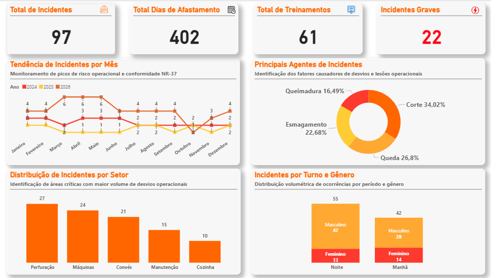

# Dashboard de Performance HSE Offshore 👷‍♂️⚓
## Offshore HSE Performance Dashboard 📊

---

### 🇧🇷 Descrição do Projeto
Este dashboard foi desenvolvido para transformar registros esparsos de incidentes em inteligência preditiva para operações offshore. O foco central é o cumprimento da **NR-37**, permitindo a identificação de correlações entre turnos, setores e agentes causadores para viabilizar ações preventivas eficientes.

### 🇺🇸 Project Description
This dashboard was developed to transform scattered incident records into predictive intelligence for offshore operations. The core focus is compliance with **NR-37** standards, enabling the identification of correlations between shifts, sectors, and causal agents to facilitate efficient preventive actions.

---

## 🚀 Resultados e Insights | Results & Insights

* **Mapeamento de Criticidade:** Identificação precisa do setor de **Perfuração** e do turno da **Noite** como prioridades para intervenção.
* **Diagnóstico de Lesões:** Constatação de que **Cortes (34%) e Quedas (26,8%)** são as maiores causas de afastamento, direcionando a revisão de EPIs.
* **Cultura Proativa:** Transição de dados reativos para uma estratégia de prevenção antecipada através da análise de tendências (2024-2026).

---

## 🛠️ Destaques Técnicos | Technical Highlights

### 🇧🇷 Funcionalidades:
* **Monitoramento NR-37:** Acompanhamento de picos de risco operacional e conformidade normativa.
* **Análise por Setor e Turno:** Distribuição volumétrica de ocorrências para alocação de treinamentos.
* **Design de Alerta:** Layout projetado com foco em alta legibilidade (UX/UI) para ambientes de alta pressão.

### 🇺🇸 Features:
* **NR-37 Monitoring:** Tracking operational risk peaks and regulatory compliance.
* **Sector & Shift Analysis:** Volumetric distribution of occurrences to guide training allocation.
* **Alert-Based Design:** Layout designed for high readability (UX/UI) in high-pressure environments.

---

## 🔧 Ferramentas | Tools
* **Power BI:** Modelagem de dados e cálculos complexos em **DAX**.
* **Excel:** Processamento, estruturação e saneamento da base (ETL).
* **Figma:** Planejamento de interface e Storytelling Visual.

---
## Como visualizar | How to view
Para interagir com os filtros, baixe o arquivo `.pbix`. 
To interact with filters, please download the `.pbix` file.
